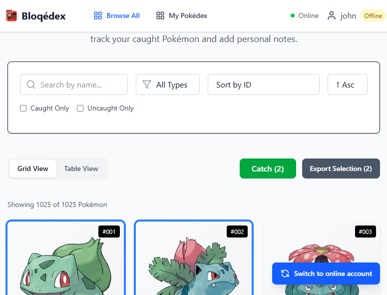
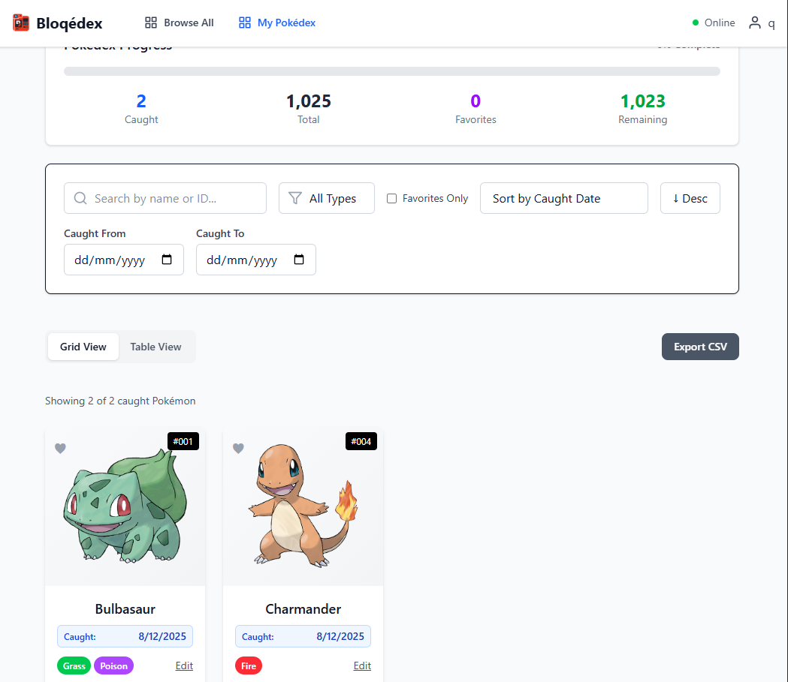

# Bloqedex Frontend

A modern, offline-first React frontend for the Bloqedx Pokédex application, built with TypeScript, Vite, and Tailwind CSS following advanced architectural patterns.

## Architecture

This project follows a clean, feature-based architecture with strong separation of concerns:

```
src/
├── components/           # Shared UI components
│   ├── common/          # Common reusable components
│   ├── layout/          # Layout-specific components
│   └── ui/              # Basic UI building blocks
├── features/            # Feature-based modules
│   ├── auth/           # Authentication & user management
│   ├── pokemon/        # Pokémon browsing & management
│   ├── pokedex/        # User's caught Pokémon
│   └── sharing/        # Pokémon sharing functionality
├── infrastructure/     # External concerns
│   ├── api/            # API clients & sync management
│   ├── repositories/   # Data access layer
│   └── storage/        # Offline storage (IndexedDB)
├── core/               # Business logic & types
│   ├── entities/       # Domain models
│   ├── types/          # TypeScript type definitions
│   └── usecases/       # Business use cases
├── stores/             # Global state management (Zustand)
├── config/             # Configuration files
└── utils/              # Utility functions
```

### Key Architectural Patterns

1. **Feature-Based Architecture** - Self-contained feature modules
2. **Repository Pattern** - Abstract data access layer
3. **Use Cases Pattern** - Business logic encapsulation
4. **Clean Architecture** - Dependency inversion principles
5. **Offline-First Design** - Local storage with smart synchronization

## Features

### Core Functionality
- **Complete Pokédex Browsing** - View all 1000+ Pokémon with detailed stats
- **Personal Collection Management** - Track caught Pokémon with notes and favorites
- **Offline-First Experience** - Full functionality without internet connection
- **Smart Synchronization** - Seamless online/offline state management
- **Advanced Filtering & Search** - Find Pokémon by name, type, stats, and more
- **Multi-View Support** - Grid and table views for different use cases

### User Experience Features
- **Responsive Design** - Optimized for desktop, tablet, and mobile
- **Real-time Status Indicators** - Online/offline status with visual feedback
- **Bulk Operations** - Catch or release multiple Pokémon at once
- **Progress Tracking** - Completion statistics and achievement progress
- **Personal Notes** - Add custom notes to caught Pokémon
- **Sharing System** - Share individual Pokémon or entire collections
- **Smart Authentication** - Support for both online and offline accounts

## Technology Stack

### Core Technologies
- **React 19** - Latest React with concurrent features
- **TypeScript 5.8** - Strict type checking and modern JS features
- **Vite 7** - Lightning fast build tool and dev server
- **Tailwind CSS 4** - Utility-first styling with custom design system

### State Management & Data
- **Zustand** - Lightweight state management with persistence
- **IndexedDB** - Browser-native offline storage
- **Axios** - HTTP client with interceptors and retry logic
- **React Router 7** - Client-side routing with data loading

### Development & Quality
- **Vitest** - Unit testing with React Testing Library integration
- **ESLint** - Code quality and consistency enforcement
- **PostCSS** - CSS processing and optimization
- **TypeScript ESLint** - Type-aware linting rules

## Prerequisites

- **Node.js 18+** or **Bun** for package management
- **Modern browser** with IndexedDB support
- **Backend API** running (see [backend README](../backend/README.md))

## Installation

1. **Clone the repository**
   ```bash
   git clone https://github.com/joao-paulo-santos/bloqedex
   cd frontend
   ```

2. **Install dependencies**
   ```bash
   npm install
   # or
   bun install
   ```

3. **Configure environment** (optional)
   ```bash
   cp .env.example .env.local
   # Edit .env.local with your backend URL if different from default
   ```

4. **Start development server**
   ```bash
   npm run dev
   # or
   bun dev
   ```

The frontend will be available at `http://localhost:3000`

## Scripts

```bash
# Development
npm run dev          # Start development server with HMR
npm run preview      # Preview production build

# Building
npm run build        # Build for production
npm run lint         # Run ESLint
npm run type-check   # TypeScript type checking

# Testing
npm run test         # Run unit tests
npm run test:ui      # Run tests with UI
npm run test:run     # Run tests once (CI mode)
```

## Offline-First Architecture

### Smart Synchronization
The frontend implements a sophisticated offline-first approach that provides seamless user experience regardless of connectivity:

- **Local-First Data** - All data is stored locally in IndexedDB
- **Smart Sync Manager** - Automatically synchronizes when online
- **Conflict Resolution** - Handles data conflicts intelligently
- **Pending Actions Queue** - Queues actions when offline for later sync
- **Progressive Enhancement** - Core features work completely offline

### Storage Strategy
- **Pokémon Data** - Cached indefinitely for offline browsing
- **User Data** - Synchronized with optimistic updates
- **Authentication** - JWT tokens with refresh logic
- **Pending Actions** - Queued and retried automatically

## State Management

### Zustand Stores
The application uses multiple specialized Zustand stores:

#### **Pokemon Store** (`usePokemonStore`)
- Manages the complete Pokédex database
- Tracks caught status for all Pokémon

#### **Auth Store** (`useAuthStore`)
- User authentication and session management
- Offline account support with sync capabilities
- JWT token management with automatic refresh
- Pending account conversion workflow

#### **Pokedex Store** (`usePokedexStore`)
- User's personal Pokémon collection
- Favorites management and statistics
- Bulk operations (catch/release multiple)
- Progress tracking and achievements

#### **App Store** (`useAppStore`)
- Global application state
- Online/offline status monitoring
- Backend health checking
- Periodic sync coordination

### Custom Hooks
Feature-specific custom hooks provide additional abstraction:

```typescript
// Smart data fetching with filters
const { caughtPokemon, filteredPokemon, stats } = useCaughtPokemon();

// Authentication state with actions
const { isAuthenticated, user, login, logout } = useAuthStore();

// Pokemon browsing with smart caching
const { pokemonMap, getFilteredPokemon, hasAllPokemon } = usePokemonStore();
```

## UI Components

### Design Principles
- **Mobile-First** - Responsive design starting from mobile
- **Consistency** - Shared design tokens and patterns


### Responsive Breakpoints
```css
/* Mobile-first approach */
sm: 640px   /* Small tablets */
md: 768px   /* Tablets */
lg: 1024px  /* Small desktops */
xl: 1280px  /* Large desktops */
```


## Feature Modules

### Authentication (`features/auth/`)
**Advanced authentication system supporting both online and offline accounts:**

- **Online Accounts** - Traditional JWT-based authentication
- **Offline Accounts** - Local accounts that sync when online
- **Account Conversion** - Seamless offline-to-online migration
- **Pending Actions** - Smart queue for offline actions

### Pokémon Browsing (`features/pokemon/`)
**Complete Pokédx browsing with advanced filtering:**

- **Smart Pagination** - Efficient loading of 1000+ Pokémon
- **Advanced Filters** - Name, type, stats, caught status
- **View Modes** - Grid and table views optimized for different use cases
- **Bulk Selection** - Multi-select for batch operations
- **Real-time Search** - Instant search


### Pokédex Management (`features/pokedx/`)
**Personal collection management:**

- **Caught Pokémon** - Track personal collection with notes
- **Favorites System** - Mark and filter favorite Pokémon
- **Progress Tracking** - Completion statistics and achievements
- **Bulk Operations** - Efficient batch catch/release
- **Personal Notes** - Custom annotations for each Pokémon

### Sharing (`features/sharing/`) [WIP]
**Share collections with other users:**

- **Individual Sharing** - Share specific Pokémon
- **Collection Sharing** - Share entire collections
- **Secure Links** - Token-based access control
- **View Limits** - Control access and expiration

## Testing Strategy

### Unit Testing with Vitest
Comprehensive test suite covering critical functionality:

```bash
# Test files follow .test.ts/.test.tsx pattern
src/
├── features/pokemon/stores/pokemonStore.test.ts
├── features/pokemon/components/PokemonCard.test.tsx
└── components/layout/Layout.test.tsx
```

### Testing Philosophy
- **Component Testing** - React Testing Library for user interactions
- **Store Testing** - Direct store testing with mocked dependencies
- **Integration Testing** - Feature-level workflow testing
- **Accessibility Testing** - Screen reader and keyboard navigation

### Mock Strategy
```typescript
// Example store test with mocked dependencies
vi.mock('../../../infrastructure/repositories', () => ({
  pokemonRepository: {
    getAllPokemon: vi.fn(),
    searchByName: vi.fn(),
  }
}))

vi.mock('../../../infrastructure/storage/IndexedDBStorage', () => ({
  indexedDBStorage: {
    getAllPokemon: vi.fn(),
    savePokemon: vi.fn(),
  }
}))
```

## Performance Optimizations

### Smart Caching Strategy
- **Stale-While-Revalidate** - Show cached data while updating
- **Background Sync** - Update data without blocking UI

### Bundle Optimization
- **Tree Shaking** - Remove unused code automatically
- **Asset Optimization** - Optimized images and fonts
- **Modern JS** - ES2022+ with fallbacks

## UI Showcase

### Browse All Pokémon

*Responsive grid layout with advanced filtering and bulk selection capabilities*

### My Pokédex Collection

*Personal collection management with progress tracking and notes*

## Deployment

### Production Build
```bash
# Build optimized production bundle
npm run build

# Preview production build locally
npm run preview
```

### Environment-Specific Builds
```bash
# Development
npm run build:dev

# Staging
npm run build:staging

# Production
npm run build:prod
```

### Deployment Targets
- **Vercel** - Optimal for React SPA with automatic deployments
- **Netlify** - Easy deployment with form handling
- **GitHub Pages** - Free hosting for open source projects
- **Docker** - Containerized deployment for any platform

### Docker Deployment
```dockerfile
FROM node:18-alpine AS builder
WORKDIR /app
COPY package*.json ./
RUN npm ci
COPY . .
RUN npm run build

FROM nginx:alpine
COPY --from=builder /app/dist /usr/share/nginx/html
COPY nginx.conf /etc/nginx/nginx.conf
EXPOSE 80
CMD ["nginx", "-g", "daemon off;"]
```


## License

This project is licensed under the MIT License - see the [LICENSE](../LICENSE) file for details.

## Acknowledgments

- **PokéAPI** for providing comprehensive Pokémon data
- **React Team** for the excellent developer experience
- **Vite Team** for the lightning-fast build tool
- **Tailwind Labs** for the utility-first CSS framework
- **Zustand** maintainers for lightweight state management
